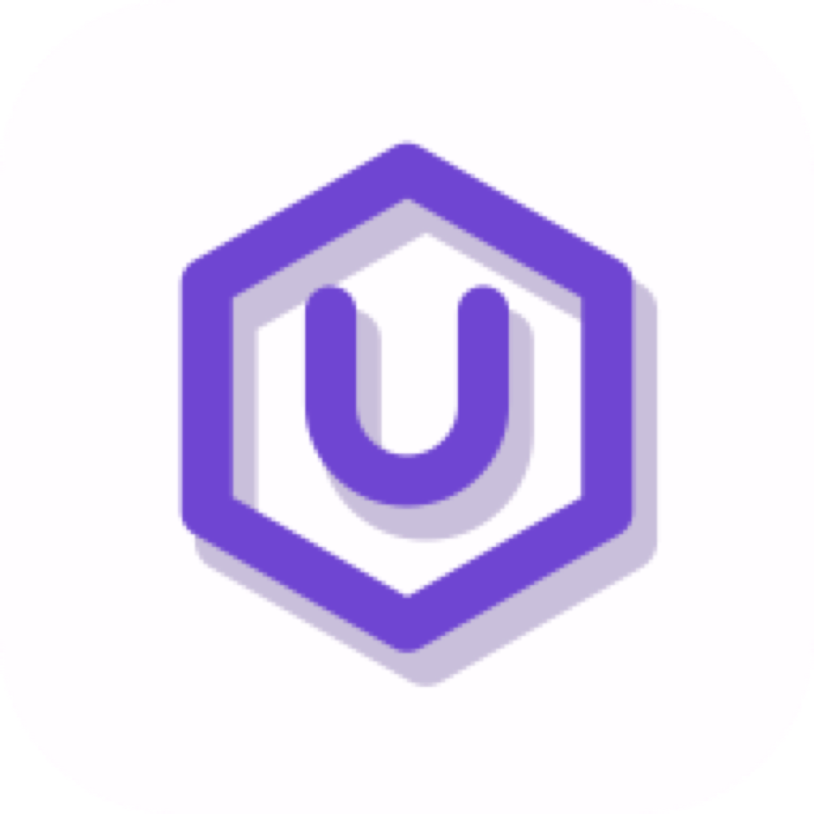

<p align="center">
  <a href="https://unvibe.site">
    
  </a>
</p>

<h1 align="center">Unvibe</h1>

<p align="center">
  <strong>Understand the code AI writes.</strong><br>
  A macOS learning layer that turns selected code into clear explanations, questions, and retained knowledge.
</p>

<p align="center">
  <a href="https://unvibe.site"></a>
  
  
  
</p>

<p align="center">
  <a href="https://unvibe.site/#demo">▶ Watch the demo</a>
  &nbsp;·&nbsp;
  <a href="https://unvibe.site">Visit unvibe.site</a>
  &nbsp;·&nbsp;
  <a href="https://unvibe.site/investors">Investor materials</a>
</p>

---

Unvibe lives beside the tools you already use. Select code, open Unvibe, choose the depth you need, and learn what the code does, why it works, and how it fits into the project—without rebuilding the same prompt in a separate chat.

## Install

Unvibe is a macOS-first private beta. A public, notarized download is published only when it has passed release validation. Until then, build a local tester DMG from this repository:

```bash
git clone https://github.com/ShadowEsu/Unvibe.git
cd Unvibe/app
npm install
npm run dist:dmg
```

The generated DMG is written to `app/release/`. Drag **Unvibe** to **Applications**, then launch it from Applications.

> **Important:** a global “select code anywhere, then ⌘U” shortcut needs macOS Accessibility permission. Copy/paste, file-based, and drag-and-drop explanations do not. macOS requires the person using the app to grant Accessibility access; Unvibe cannot enable it silently.

## Why Unvibe

- **Understand selected code in context** — capture a selection, an active file, an uncommitted diff, or a lightweight project summary.
- **Choose your depth** — start with a plain-language explanation or move through Beginner, Intermediate, Advanced, and Expert depth when available on your plan.
- **Learn without leaving flow** — a compact floating bar and explanation widget stay close to the code rather than making you repeat context in another chat.
- **Ask, test, retain** — follow up, take a comprehension check, save an explanation, and revisit it in your learning history.
- **Keep privacy deliberate** — local filtering excludes common secret files and detects sensitive values before a remote request. The backend never reads a repository directly.
- **Track real learning signals** — explanations, quiz results, review activity, streaks, and mastery are derived from recorded activity instead of decorative analytics.

## The learning loop

```text
Select code → ⌘U → choose depth → understand the explanation
      → ask a follow-up / explain differently / test me → save and review later
```

| Surface | Purpose |
| --- | --- |
| **Floating bar** | Shows the current capture and opens a focused explanation flow. |
| **Explanation widget** | Streams the explanation, supports depth changes, follow-ups, saving, and comprehension checks. |
| **Companion app** | Home, history, study, concepts, snippets, briefings, projects, progress, settings, and account controls. |
| **Learning sync** | Persists activity locally first, then syncs it when an authenticated backend is configured. |

## What Unvibe supports today

| Area | Current support |
| --- | --- |
| **Desktop** | macOS, with Apple Silicon tester packaging configured. |
| **Code capture** | Selected text via Accessibility; clipboard fallback; active-file, git-diff, and project-context review flows. |
| **Explanation levels** | New, Beginner, Intermediate, Advanced, and Expert. Some deeper modes are plan-gated. |
| **Learning** | Follow-up Q&A, one-question comprehension checks, saved explanations/snippets, history, progress, streaks, and skills. |
| **Editor ecosystem** | The desktop app detects locally available tools such as Cursor and VS Code. It only presents integrations the app can verify; it does not silently change their settings. |
| **Backend** | Next.js API and dashboard with Supabase-backed production storage or labelled in-memory development storage. |

## Privacy and data handling

Unvibe is designed so that code context is prepared on the device before it can leave the device.

- Default exclusions include `.env` files, private keys, tokens, dependency folders, build output, binaries, `.gitignore` matches, and `.unvibeignore` matches.
- The desktop main process—not the renderer—owns remote requests, so a UI path cannot bypass the local secret filter.
- When cloud analysis is enabled, users can review the context sent for a repository. Unvibe does not claim local-only analysis when a hosted model is being used.
- Provider credentials belong on the hosted backend. Do not ship an AI provider key inside a DMG.

Read the full [privacy overview](docs/privacy.md) and [architecture](docs/architecture.md).

## Run locally

### Marketing website

```bash
cd marketing
npm install
npm run dev
```

Runs the product website and waitlist at `http://localhost:3000`. See [marketing/README.md](marketing/README.md) for waitlist notifications and deployment configuration.

### Desktop app

```bash
cd app
npm install
npm run dev
```

This builds and launches the Electron app. The desktop app expects a backend at `http://localhost:8787` unless `UNVIBE_BACKEND` is set.

### Backend and web dashboard

```bash
cd web
npm install
npm run dev
```

The backend supplies the AI, account, billing, and learning-sync APIs, and the companion dashboard.

- Without provider/database configuration, development uses an explicitly labelled mock AI provider and in-memory store.
- `ANTHROPIC_API_KEY` enables real provider calls in development.
- `SUPABASE_URL` and `SUPABASE_SERVICE_ROLE_KEY` enable the production data store.
- Billing remains server-authoritative; configure Stripe **test-mode** values before testing subscriptions. See [billing notes](docs/billing.md).

## Repository map

| Directory | What is here |
| --- | --- |
| [`app/`](app/) | Primary macOS desktop app: Electron main process, capture, secret filtering, floating UI, companion, and local learning store. |
| [`web/`](web/) | Next.js backend, dashboard, auth/device flow, AI endpoints, sync, billing, and Supabase migrations. |
| [`marketing/`](marketing/) | `unvibe.site` marketing experience, waitlist, pricing presentation, and investor page. |
| [`extension/`](extension/) | Parked VS Code/Cursor extension; its useful context logic informs the desktop product. |
| [`docs/`](docs/) | Architecture, privacy, release process, billing, validation, legal, and investor documentation. |

## Development checks

Run the checks relevant to the surface you changed:

```bash
# Desktop
cd app && npm run typecheck && npm test && npm run build

# Backend/dashboard
cd web && npm run typecheck && npm run build

# Marketing site
cd marketing && npm run typecheck && npm run build
```

Do not present mock AI, in-memory data, unsigned packaging, or unverified billing as production-ready functionality.

## Community and support

This repository is the engineering home for Unvibe. For a useful report, include the app version, macOS version, whether Accessibility was granted, the capture source, and any safe-to-share diagnostic detail. Never attach secrets or raw private code.

| Channel | Best for |
| --- | --- |
| [GitHub issues](https://github.com/ShadowEsu/Unvibe/issues) | Reproducible bugs and implementation-focused feature requests. |
| [preston@unvibe.site](mailto:preston@unvibe.site) | Private-beta support and account questions. |
| [prestonjaysusanto@gmail.com](mailto:prestonjaysusanto@gmail.com) | Founder questions, product feedback, and investor contact. |

## FAQ

### Does Unvibe generate code?

Its purpose is code comprehension: helping someone understand, verify, and retain AI-generated or unfamiliar code. It can answer follow-up questions about the selected context, but it is not positioned as another code-generation workspace.

### Can Unvibe read every app’s selection without permission?

No. macOS requires Accessibility permission for cross-app selection capture. Unvibe asks only when the global capture feature is activated and provides non-Accessibility fallbacks.

### Is the code sent to a model provider?

Only when cloud analysis is enabled and after local filtering. The backend does not inspect a repository itself; it receives only the selected, filtered context supplied by the app.

### Where can I see the product?

Visit [unvibe.site](https://unvibe.site), watch the [demo](https://unvibe.site/#demo), or view [investor materials](https://unvibe.site/investors).

---

<p align="center">
  <a href="https://unvibe.site">unvibe.site</a>
  &nbsp;·&nbsp;
  <a href="https://unvibe.site/#demo">Demo</a>
  &nbsp;·&nbsp;
  <a href="docs/privacy.md">Privacy</a>
  &nbsp;·&nbsp;
  <a href="mailto:preston@unvibe.site">Contact</a>
</p>
